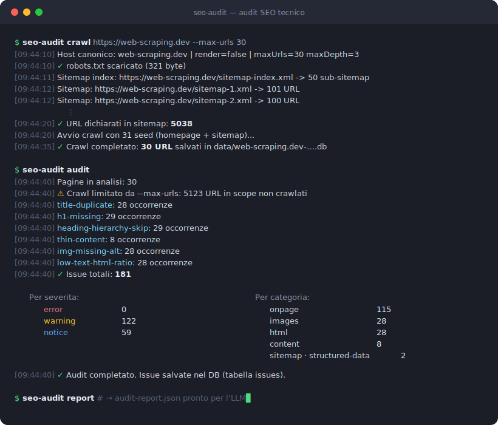

# audit-seo-tecnico

> 🇬🇧 **Technical SEO audit CLI** (docs in Italian): full-site crawler, deterministic
> rule engine (~40 checks), Lighthouse sampling and an LLM-ready JSON report.

<p align="center">
  
</p>

Tool da riga di comando (Node.js, ESM) che esegue un audit SEO **tecnico** di un sito:
crawl dell'intero sito, raccolta di dati strutturati per ogni URL, motore di regole
deterministico per i problemi tecnici, e report JSON pronto per essere sintetizzato
da un LLM.

> Fuori scope (per scelta): backlink, volumi keyword, SERP tracking — dati proprietari.
> Qui ci si concentra solo su cio' che dipende da **crawling + regole**.

## ⚠️ Uso responsabile

Questo tool è pensato per **siti tuoi o per cui hai l'autorizzazione** del
proprietario (audit per clienti, siti propri):

- **Crawla deliberatamente anche gli URL bloccati da robots.txt**: è una funzione
  di audit (scoprire pagine bloccate per errore), non un via libera a ignorare le
  regole di siti altrui.
- I default di rate limit sono conservativi (5 richieste parallele, delay 250ms):
  non abbassarli su server che non gestisci tu.
- Lo User-Agent di default si identifica come bot (`audit-seo-tecnico`, con il
  link a questo repo): non usare `--googlebot` per mascherarti su siti non tuoi.

## Stato

- **Fase 1 — crawl**: ✅ implementata.
- **Fase 2 — audit** (motore di regole): ✅ implementata.
- **Fase 3 — perf** (Lighthouse su campione): ✅ implementata.
- **Fase 4 — report** (`audit-report.json`): ✅ implementata.

## Stack

- Node.js LTS (testato su Node 24) con ESM.
- [Crawlee](https://crawlee.dev): `CheerioCrawler` di default (siti server-rendered,
  veloce), `PlaywrightCrawler` opzionale via `--render` per siti JS-driven.
- [better-sqlite3](https://github.com/WiseLibs/better-sqlite3): storage locale sincrono
  (binari precompilati arm64 → gira nativamente su Apple Silicon).
- [fast-xml-parser](https://github.com/NaturalIntelligence/fast-xml-parser): parsing sitemap.
- [robots-parser](https://github.com/samclarke/robots-parser): matching robots.txt.
- [Lighthouse](https://github.com/GoogleChrome/lighthouse): Core Web Vitals sul campione di pagine.

## Installazione

### Via npm (consigliata)

```bash
npm install -g audit-seo-tecnico
seo-audit crawl https://tuosito.it
```

### Da sorgente (per sviluppo)

```bash
git clone https://github.com/fedec089/audit-seo-tecnico.git
cd audit-seo-tecnico
npm install

# (opzionale) per la modalità --render serve il browser di Playwright:
npx playwright install chromium
```

Richiede Node.js ≥ 20 (LTS). Testato su macOS Apple Silicon: `better-sqlite3`
usa binari precompilati arm64, nessuna toolchain di compilazione necessaria.


## Uso

Il tool è strutturato in **fasi indipendenti**, ognuna un sub-comando, così puoi
ri-eseguire le analisi senza ri-crawlare.

```bash
# Fase 1 — crawl (homepage + sitemap), salva in data/<host>-<timestamp>.db
node bin/seo-audit.js crawl https://www.esempio.it

# le fasi successive (in arrivo) leggono di default data/latest.db
node bin/seo-audit.js audit
node bin/seo-audit.js perf
node bin/seo-audit.js report
```

Dopo `npm link` (o installazione globale) il comando è disponibile come `seo-audit`.

### Opzioni di `crawl`

| Flag | Default | Descrizione |
|------|---------|-------------|
| `<url>` | — | URL di partenza (homepage), **obbligatorio** |
| `--host <host>` | host dello startUrl | host canonico (es. `www.esempio.it`) |
| `--sitemap <url>` | `<origin>/sitemap.xml` | URL della sitemap |
| `--subdomains` | off | includi i sottodomini nello scope |
| `--user-agent <ua>` | UA descrittivo del tool | User-Agent personalizzato |
| `--googlebot` | off | usa lo UA di Googlebot |
| `--render` | off | usa Playwright (rendering JS) invece di Cheerio |
| `--concurrency <n>` | 5 | richieste parallele |
| `--delay <ms>` | 250 | delay minimo same-domain |
| `--max-urls <n>` | 1000 | limite di sicurezza sul numero di URL |
| `--max-depth <n>` | 10 | profondità massima dal seed |
| `--timeout <ms>` | 30000 | timeout di rete per richiesta |
| `--retries <n>` | 1 | retry per richiesta |
| `--exclude <pattern>` | pattern Woo/WP | regex da escludere (ripetibile) |
| `--db <path>` | `data/<host>-<timestamp>.db` | percorso del DB |

Esempi:

```bash
# Sito WordPress server-rendered, scope solo dominio principale
node bin/seo-audit.js crawl https://www.esempio.it --host www.esempio.it --max-urls 500

# Sito con contenuto iniettato via JS
node bin/seo-audit.js crawl https://app.esempio.it --render

# Crawl "come Googlebot", più conservativo
node bin/seo-audit.js crawl https://www.esempio.it --googlebot --concurrency 3 --delay 500
```

## Come funziona la Fase 2 (audit)

`audit` carica i dati crawlati in memoria ed esegue un **motore di regole modulare**:
ogni regola è una funzione che riceve il dataset e ritorna le occorrenze di una issue.
Le issue vengono salvate nella tabella `issues` (un record per occorrenza
`regola → URL`, con `detail` JSON). Ogni esecuzione **sostituisce** le issue precedenti.

```bash
node bin/seo-audit.js audit                       # usa data/latest.db
node bin/seo-audit.js audit --db data/sito.db
node bin/seo-audit.js audit --only onpage,content # solo alcune categorie
node bin/seo-audit.js audit --check-external      # verifica anche i link esterni (rete)
```

Severità: `error` / `warning` / `notice`. Categorie e regole principali:

| Categoria | Regole |
|-----------|--------|
| `status` | 4xx, 5xx, catene di redirect (>1 hop), loop di redirect |
| `indexability` | noindex in sitemap, noindex con link interni, robots blocca pagina indicizzabile, canonical assente / verso non-200 / concatenato |
| `sitemap` | nessuna sitemap valida trovata, sitemap "sporca" (404/redirect/noindex), pagine orfane (in sitemap ma non linkate), linkate ma non in sitemap |
| `onpage` | title mancante/corto/lungo/duplicato, meta description mancante/corta/lunga/duplicata, H1 mancante/multiplo, gerarchia heading saltata |
| `content` | thin content, contenuto duplicato (hash esatto) |
| `structured-data` | JSON-LD malformato, tipo schema.org non riconosciuto |
| `hreflang` | non reciproco, target non-200, x-default mancante, conflitto con canonical |
| `images` | immagini senza alt |
| `links` | link interni rotti, link esterni rotti (con `--check-external`), link interni verso redirect, nofollow interni, anchor text vuoto |
| `html` | `<html lang>` / charset / doctype / viewport mancanti, text-to-HTML ratio basso |
| `technical` | mixed content, http non rediretto a https, host alternativo raggiungibile |

Le soglie on-page sono calibrate per avvicinarsi a Semrush (`titleMin: 15`,
`titleMax: 70`, `metaDescMax: 160`, `textHtmlRatioMin: 0.10`). Su **archivi e
paginazioni** (`/category/…`, `/tag/…`, `/page/N/`, `?paged=`) `title-duplicate` e
`metadesc-missing` sono declassate a `notice` (pattern atteso), così le issue vere
non vengono sommerse. L'anchor text usa l'*accessible name* (testo → alt → aria-label
→ title): un link-immagine con `alt` non è "senza anchor".

I controlli on-page/contenuto girano solo sulle **vere pagine HTML 200 indicizzabili**
(esclusi xml/feed/sitemap anche se il server li etichetta come `text/html`).

### Ispezionare le issue

```bash
sqlite3 data/latest.db "SELECT severity, category, COUNT(*) FROM issues GROUP BY 1,2;"
sqlite3 data/latest.db "SELECT url, message FROM issues WHERE rule_id='broken-internal-link';"
```

## Come funziona la Fase 3 (perf)

`perf` non gira Lighthouse su tutto il sito (lento e pesante): seleziona un
**campione rappresentativo** e misura solo quello.

- **Campionamento**: raggruppa le pagine HTML 200 indicizzabili per *template*
  (euristica sul path: `home`, `/(top-level)`, `/servizi/`, `/blog/x/`…) e prende
  un rappresentante per gruppo (quello con più link interni in ingresso),
  priorità alla homepage e ai template più diffusi.
- **Lighthouse headless** su ciascun campione → salva `LCP`, `CLS`, `TBT`,
  `performance score` (+ FCP/Speed Index/TTI come extra) nella tabella `perf`.
- **INP**: è una metrica *di campo* (non lab); si ottiene solo con `--psi-key`
  (PageSpeed Insights → dati CrUX reali degli utenti).

```bash
node bin/seo-audit.js perf                          # auto-campione (default 6), mobile
node bin/seo-audit.js perf --max-samples 8 --desktop
node bin/seo-audit.js perf --sample https://sito.it/ --sample https://sito.it/prodotto/1

# Dati di campo CrUX (incluso INP): preferisci la env var alla flag,
# così la key non finisce nella shell history
export PSI_API_KEY=la-tua-key
node bin/seo-audit.js perf
```

Richiede Google Chrome installato (Lighthouse lo lancia headless via `chrome-launcher`).

```bash
sqlite3 data/latest.db "SELECT template, url, perf_score, lcp_ms, cls, tbt_ms FROM perf;"
```

## Come funziona la Fase 4 (report)

`report` aggrega tutto (pages + issues + perf + metadati) in un unico
`audit-report.json`, **senza troncamenti**, pensato per essere dato in pasto a un
LLM per sintesi e prioritizzazione. Struttura:

```jsonc
{
  "meta":     { "site", "crawl": { "crawledCount", "cappedByMaxUrls", … }, "thresholds", "caveats": [] },
  "summary":  { "totalPages", "statusDistribution", "indexability",
                "issues": { "total", "bySeverity", "byCategory", "byRule" },
                "performance": { "sampled", "avgPerfScore", "worstLcpMs", … } },
  "issues":   { "<categoria>": [ { "ruleId", "severity", "message", "count",
                                   "occurrences": [ { "url", "detail" } ] } ] },
  "sitemapVsCrawl": { "counts": { "onlyInSitemap", "onlyInCrawl", "inBoth" },
                      "orphanCandidates": [], "linkedNotInSitemap": [],
                      "onlyInSitemap": [], "onlyInCrawl": [] },
  "performance": [ { "url", "template", "lab": {…}, "field": { "inpMs", "crux" } } ]
}
```

- `meta.caveats` segnala i limiti di affidabilità (es. crawl troncato da
  `--max-urls`, sitemap assente) così la sintesi LLM non sovrastima i risultati.
- I tre **diff set** sitemap↔crawl sono in `sitemapVsCrawl` (solo-sitemap /
  solo-link / entrambi), con le orfane "vere" già filtrate (200 + indicizzabili).

```bash
node bin/seo-audit.js report                  # -> audit-report.json (usa data/latest.db)
node bin/seo-audit.js report --out report.json --db data/sito.db
```

## Pipeline completa

```bash
node bin/seo-audit.js crawl https://www.esempio.it --max-urls 1000
node bin/seo-audit.js audit
node bin/seo-audit.js perf --max-samples 6
node bin/seo-audit.js report                  # -> audit-report.json
```

## Configurazione

Copia `audit.config.example.js` in `audit.config.js` per impostare host canonico,
esclusioni, rate limit e soglie dei controlli. **Precedenza**: default ← file di
config ← flag CLI. Supportati anche `audit.config.json` e `audit.config.mjs`.

## Come funziona la Fase 1 (crawl)

1. **robots.txt**: scaricato e usato *solo* per registrare se un URL *sarebbe* bloccato
   (gli URL bloccati vengono comunque crawlati, per scoprire blocchi accidentali).
2. **Sitemap**: discovery robusta — legge la direttiva `Sitemap:` da robots.txt,
   con fallback sui percorsi canonici (`/sitemap_index.xml`, `/sitemap.xml`,
   `/wp-sitemap.xml`), e risolve ricorsivamente i *sitemap index* annidati. Se
   nessuna sitemap è raggiungibile, l'audit emette l'issue `sitemap-missing`.
3. **Seed**: homepage + tutti gli URL della sitemap.
4. **Crawl**: segue i link interni entro `--max-depth`/`--max-urls`, applicando le
   esclusioni (Woo/WP) **solo** agli URL trovati via link (non a quelli in sitemap).
5. **Provenienza**: per ogni URL si registra `discovered_via` (`sitemap` / `link` /
   `both`) e la pagina sorgente — il confronto sitemap↔crawl è esso stesso un risultato.
6. **Redirect**: ogni URL che risponde con 3xx viene salvato come riga con il suo status
   reale e la catena completa in `redirects`; la destinazione finale viene accodata e
   crawlata come pagina a sé.
7. **Verdetto `indexable`**: combina status + meta robots + X-Robots-Tag + canonical.

Tutti i dati vanno in SQLite (schema in [`src/db/schema.sql`](src/db/schema.sql)).
Una run = un file DB; `data/latest.db` è un symlink all'ultima run.

### Ispezionare il DB

```bash
sqlite3 data/latest.db "SELECT discovered_via, COUNT(*) FROM pages GROUP BY discovered_via;"
sqlite3 data/latest.db "SELECT url, status_code, indexable_reason FROM pages WHERE indexable=0;"
```

## Struttura del progetto

```
bin/seo-audit.js         # entrypoint CLI (commander)
src/config.js            # merge config: default ← file ← CLI
src/db/                  # schema.sql, apertura DB, repository (prepared statements)
src/commands/            # un file per sub-comando
src/crawl/               # crawler, extractor, sitemap, robots, url-utils, indexability
src/util/                # logger, costanti
data/                    # DB delle run (gitignored) + latest.db
```

## Test

```bash
npm test   # node:test nativo, nessuna dipendenza extra
```

Coprono normalizzazione URL e scope (incluse le guardie anti scope-escape),
verdetto di indicizzabilità, estrazione on-page (title/meta/heading/link/immagini/
JSON-LD/hreflang/risorse) e il campionamento per template.

## Limitazioni note

- **Domini con suffisso a due livelli** (es. `.co.uk`): con `--subdomains` il
  calcolo del dominio registrabile è naive (ultimi 2 label) e lo scope può essere
  troppo ampio. Per i TLD semplici (`.it`, `.com`…) non ci sono problemi.
- In modalità `--render` la cattura della catena di redirect è "best effort"
  (ricostruita dalla request di Playwright) ed è meno dettagliata della modalità Cheerio.
- `INP` è una metrica di campo: senza `PSI_API_KEY` non è disponibile (Lighthouse
  lab fornisce TBT come proxy).

## Licenza

[MIT](LICENSE)
